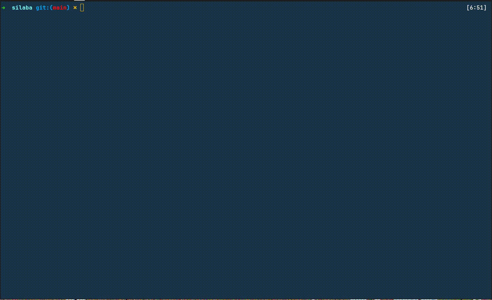

# silaba
Pronuncia as palavras digitadas, para mostrar para crianças os sons das letras.

## Pré-requisitos

- Python 3.12
- [GCloud CLI](https://cloud.google.com/sdk/docs/install?hl=pt-br) logado com a conta que tem acesso ao projeto do Google Cloud
- [uv](https://github.com/astral-sh/uv)

Alterar a variável `_projeto_google_cloud` no arquivo `fala.py` para o nome do projeto do Google Cloud.

## Execução

```bash
uv run silaba.py
```


