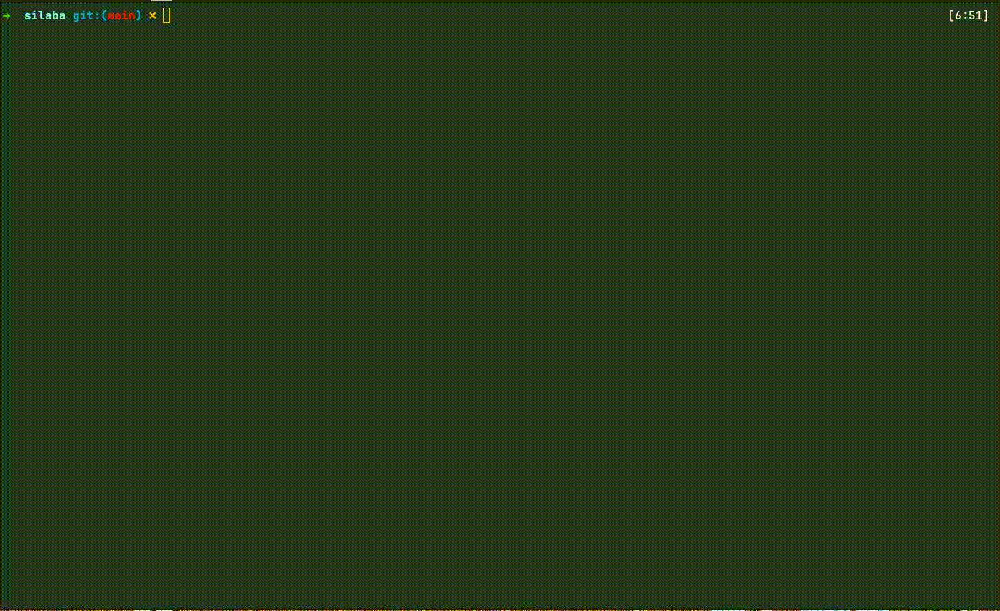

# silaba
Pronuncia as palavras digitadas, para mostrar para crianças os sons das letras.

## Pré-requisitos

- Python 3.12
- [uv](https://github.com/astral-sh/uv)
- Acesso à internet para geração de áudio via gTTS

O backend padrão de fala agora é o `gTTS`, então Google Cloud não é necessário no fluxo normal. O backend do Google Cloud continua disponível como fallback opcional e só exige credenciais se precisar ser usado.

Instale as dependências com:

```bash
uv sync --group dev
```

## Execução

Aplicativo desktop:

```bash
uv run silaba.py
```

Servidor FastAPI e interface para celular:

```bash
uv run uvicorn server:app --host 0.0.0.0 --port 8000
```

Abra `http://<ip-da-maquina>:8000` no navegador do smartphone para usar a interface web.

## API

- `GET /api/audio/{texto}` retorna o MP3 gerado ou cacheado.
- O texto aceita apenas letras ou apenas números, com no máximo 10 caracteres.

## Backend de fala

- Padrão: `gTTS`
- Fallback: Google Cloud Text-to-Speech
- Override opcional para depuração: `SILABA_TTS_BACKEND=gtts` ou `SILABA_TTS_BACKEND=google`


